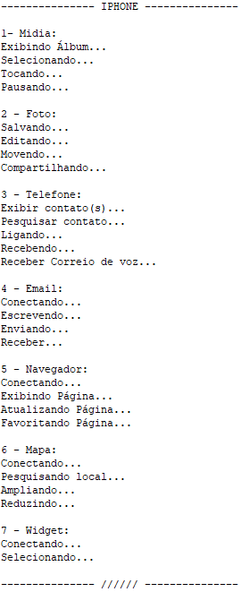

# Programação Orientada a Objetos
## Projeto: IPhone
#### Por: DIO - Digital Innovation One

### Sobre o Projeto

Este projeto em Java simula funcionalidades do iPhone, destacando Organização e Orientação a Objetos. Utiliza Abstração e Herança para criar uma hierarquia de classes, representando diferentes componentes do iPhone. O laço For é empregado para iterar sobre coleções.

##### About the project

This Java project simulates iPhone functionalities, highlighting Organization and Object Orientation. It uses Abstraction and Inheritance to create a hierarchy of classes, representing different components of the iPhone. The For loop is used to iterate over collections.

### Diagrama de Classe
##### Class Diagram

")

### Ferramentas Utilizadas
##### Tools Used

<table>
    <head>
        <tr><th>IDE</th><th>Versão</tr>
    </head>
    <body>
        <tr><td>Eclipse</td><td>2024-03 (4.31.0)</td></tr>        
    </body>
</table>

### Tecnologias Utilizadas
##### Technologies Used

 <table>
    <head>
        <tr><th>Tecnologia</th><th>Descrição</th></tr>
    </head>
    <body>
        <tr>
            <td>JDK</td>
            <td>Java 17</td>
        </tr>
        <tr>
            <td>Paradgma</td>
            <td>Orientação a Objetos</td>
        </tr>        
        <tr>
            <td>Loop</td>
            <td>For</td>
        </tr>
    </body>
</table>

### Organização do Projeto
##### Project Organization

")

### Autor (Author)
#### Katarine Albuquerque
###### Desenvolvedora Front-end (Developer)
   
